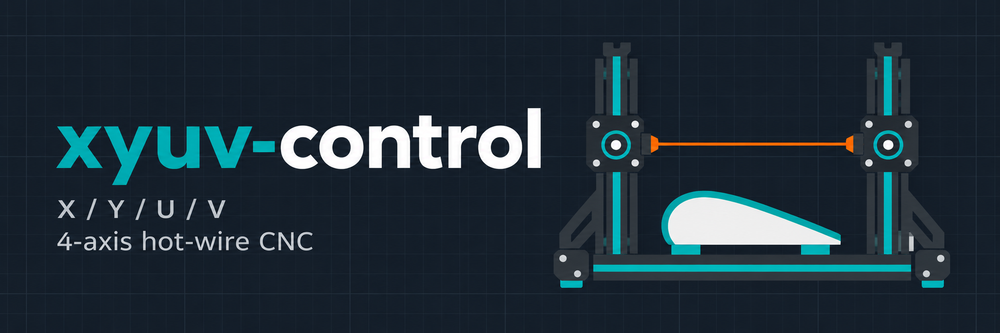

# xyuv-control

4-axis X/Y/U/V CNC controller for hot-wire foam cutters based on Raspberry Pi Pico 2 W, MicroPython and G-code

## Dokumentation

- [Pico und DRV8825: Aufbau und Inbetriebnahme](docs/Raspi_pico_DRV8825.md): deutsche Anleitung für den Einzelachsentest.
- [Entwicklungsplan](docs/Entwicklungsplan.md): vom einachsigen Testaufbau zur Vierachsensteuerung.
- [Timeline und Versionsschritte](docs/TIMELINE.md): geplante Meilensteine und Vorlage für das Versionsprotokoll.
