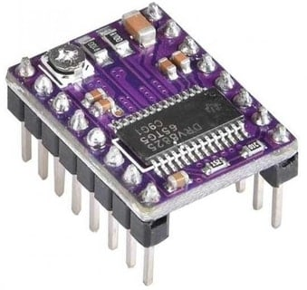
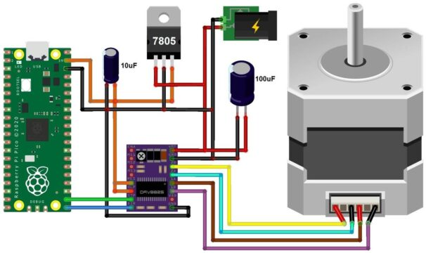
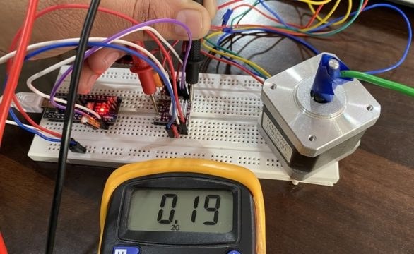

# Raspberry Pi Pico / Pico 2 W mit DRV8825

Deutsche Anleitung für den einachsigen Testaufbau von **xyuv-control**.
Stand: 04.10.2026. Diese Anleitung beschreibt einen geplanten Aufbau; das
Testprogramm wurde noch nicht an der Hardware ausgeführt.

## 1. Ziel und Grundlagen

Ein bipolarer Schrittmotor wird über ein DRV8825-Modul angesteuert. Der Pico
liefert STEP-Pulse und die Richtung DIR. Die Motorenergie kommt aus einem
separaten Netzteil. Zunächst wird ein frei laufender Motor ohne angeschlossene
Mechanik und ohne Schneiddraht getestet. Erst danach folgt die Testachse.

Ausgangspunkt ist der [Artikel von How2Electronics](https://how2electronics.com/control-stepper-motor-with-drv8825-raspberry-pi-pico/).
Die folgende Verdrahtung und das Programm sind für unser Projekt eigenständig
ausgearbeitet. Verbindliche elektrische Grenzwerte liefert das
[TI-Datenblatt](https://www.ti.com/lit/ds/symlink/drv8825.pdf).



*Abbildung 1: Modulbeispiel aus How2Electronics, [Originalbild](https://how2electronics.com/wp-content/uploads/2020/12/DRV8825-Stepper-Driver-Module.jpg).
Das Aussehen allein bestätigt weder Pinbelegung noch Messwiderstand.*

## 2. Benötigte Teile

| Teil | Für den ersten Test |
| --- | --- |
| Controller | Raspberry Pi Pico 2 W mit passenden Stiftleisten |
| Treiber | Ein DRV8825-Modul; später vier Module |
| Motor | Bipolarer Vierleitermotor; vorgesehen: NEMA 17, 1,5 A |
| Motorversorgung | Geregeltes 12-V- oder geplantes 24-V-Netzteil, möglichst mit Strombegrenzung |
| Pufferkondensator | Als Ausgangspunkt 100 µF direkt an VMOT/GND; bei 24 V vorzugsweise 50-V-Ausführung |
| Anschlussmaterial | Strombelastbare Motor- und Versorgungsleitungen, geeignete Klemmen |
| Pull-up | 10 kΩ zwischen ENABLE und 3,3 V |
| Kühlung | Passender Kühlkörper, bei Bedarf Luftstrom |
| Messgeräte | Multimeter; für Pulstiming optional Oszilloskop/Logikanalysator |
| USB | Datenkabel zum Computer |

Der Kondensatorwert ist ein Planungswert und muss für die spätere Platine
anhand Leitungslänge, Versorgung und Messungen überprüft werden. Eine
Spannungsreserve ersetzt keine Schutzschaltung gegen Spannungsspitzen.
Motorströme nicht über dünne Steckbrettleitungen führen.

### Spannungsspitzen und Kühlkörper

Leitungsinduktivität und niederohmige Keramikkondensatoren können beim
Schalten Spannungsspitzen erzeugen, auch bei nur 12 V Versorgung.
Ein Elko unmittelbar an VMOT/GND hilft gegen diese LC-Spitzen.
Den Kühlkörper so montieren, dass er keine Pins oder Bauteile kurzschließt.
Diese zusätzlichen Hinweise stammen aus
[Last Minute Engineers](https://lastminuteengineers.com/drv8825-stepper-motor-driver-arduino-tutorial/).

Die projektspezifischen [Treibermodule](https://link.amazon/B02MzzIzi) sind noch
nicht eindeutig identifiziert. Vor dem Anschluss ihre Beschriftung,
Unterlagen und Sense-Widerstände prüfen.

## 3. Was am Ausgangsartikel zu beachten ist

Der Artikel verwendet GP16 für DIR und GP17 für STEP. Diese Zuordnung behalten
wir für den Einzelachsentest bei. Seine Verdrahtungsabbildung ist nachfolgend
als Referenz eingebunden, nicht als geprüfter Bauplan für unsere Platine.



*Abbildung 2: How2Electronics, [Originalbild](https://how2electronics.com/wp-content/uploads/2023/05/DRV8825-Raspberry-Pi-Pico-NEMA17-Stepper-Motor-606x360.jpg).
Für den Nachbau gelten die Anschlussliste und Versorgungshinweise dieser Anleitung.*

Korrekturen zum Artikel:

- Ein übliches DRV8825-Steckmodul hat keinen externen VDD-Versorgungseingang.
  Nicht mit A4988-Modulen verwechseln; der entsprechende Anschluss kann FAULT sein.
- `I = 2 × VREF` gilt nur bei passenden Sense-Widerständen.
- Die Versorgungsspannung betrifft den Treiber, nicht eine geforderte
  Nennspannung der Motorwicklung.
- Bei einem Timer, der STEP abwechselnd umschaltet, erzeugen zwei Aufrufe
  einen vollständigen Puls. Eine Wartezeit in Millisekunden zählt keine Schritte.
- Eine pauschale Kühlungsfreigabe für sämtliche Nachbaumodule ist ungeeignet.

## 4. Verdrahtung des Einzelachsentests

**Vor jeder Änderung Netzteil und USB trennen und Kondensatoren entladen lassen.**
Motorstecker niemals bei eingeschaltetem Treiber ein- oder ausstecken.

### 4.1 Anschlusstabelle

Die physischen Pico-Pinnummern gelten bei Blick auf die Oberseite mit USB oben.
Die Treiberanschlüsse anhand ihrer Namen identifizieren; keine Steckplatzposition
aus einer fremden Abbildung übernehmen.

| Pico / Versorgung | DRV8825-Anschluss | Funktion |
| --- | --- | --- |
| GP16, Pin 21 | DIR | Drehrichtung |
| GP17, Pin 22 | STEP | Schrittimpulse |
| GP18, Pin 24 | ENABLE / nENBL | LOW: aktiv; HIGH: Ausgänge deaktiviert |
| 3V3(OUT), Pin 36 | RESET und SLEEP | Für diesen Test beide auf HIGH |
| GND, z. B. Pin 23 | Logik-GND | Gemeinsamer Signalbezug |
| Netzteil Plus | VMOT | Motorversorgung |
| Netzteil Minus | Motor-GND | Mit Logik-GND und Pico-GND verbinden |
| Wicklung A | A1 und A2 | Ein zusammengehöriges Aderpaar |
| Wicklung B | B1 und B2 | Das zweite Aderpaar |
| GND | M0, M1, M2 | Zunächst Vollschritt |

Zusätzlich 10 kΩ von ENABLE nach Pico-3,3 V vorsehen. Damit bleibt der
Treiber bei hochohmigem GP18 deaktiviert. Der reine Software-Startwert schützt
nicht während des gesamten Bootvorgangs. Alleinige Motorversorgung ohne
Pico-Versorgung separat prüfen; dafür benötigt die endgültige Platine eine
auch in diesem Zustand wirksame Freigabeschaltung.

### 4.1.1 ENABLE, SLEEP und RESET unterscheiden

| Eingang auf LOW | Wirkung am DRV8825 |
| --- | --- |
| ENABLE | Ausgänge aktiv |
| SLEEP | Stromsparmodus |
| RESET | Ausgänge aus; interner Schrittindex zurückgesetzt |

RESET fährt die Maschine **nicht** zum Referenzschalter und bestimmt keine
mechanische Position. Eine Referenzfahrt bleibt erforderlich. Offenes ENABLE
kann wegen des internen Pull-downs aktiv sein; daher die externe Freigabe
verwenden. Grundlage: [TI, Pin-Funktionen](https://www.ti.com/lit/ds/symlink/drv8825.pdf).

FAULT bleibt beim ersten Test unbeschaltet. Vor späterer GPIO-Anbindung
Modulschaltung prüfen, einschließlich einer möglichen Kopplung an SLEEP.
Am IC ist nFAULT ein Open-Drain-Ausgang; Pull-up nur zu einem Pico-kompatiblen
Pegel vorsehen. [TI](https://www.ti.com/lit/ds/symlink/drv8825.pdf)

### 4.2 Eigenes Anschlussschema

```text
Computer -- USB --> Pico 2 W
                    GP16 ---------------- DIR
                    GP17 ---------------- STEP
                    GP18 ----+----------- ENABLE
                             |
                            10 kΩ
                             |
                    3V3 -----+----------- RESET
                     |------------------- SLEEP
                    GND ----------------- Logik-GND
                     |                        |
Netzteil Minus ------+-------------------- Motor-GND
                     |                        |
                     +------ (-) C1 (+) -------+---- VMOT
                                              |
Netzteil Plus -------- Sicherung -------------+

DRV8825: A1 --- Wicklung A --- A2
         B1 --- Wicklung B --- B2
         M0, M1, M2 jeweils nach GND (Vollschritt)

C1: z. B. 100 µF, Polarität beachten, direkt am Modul.
```

Die GPIOs arbeiten mit 3,3 V. Keine 5 V oder 24 V an Pico-Eingänge legen.
Für die endgültige Platine siehe [Projektplan](Projektplan.md).

## 5. Versorgung des Pico

Für den ersten Test erhält der Pico seine Versorgung ausschließlich über USB.
Die Motorversorgung wird nicht an den Pico angeschlossen; gemeinsam ist nur
GND. So lässt sich die Motorseite getrennt einschalten und messen.

Für die Controllerplatine ist ein DC/DC-Abwärtswandler von 24 V auf 5 V vorgesehen.
Die 5 V werden über eine zusätzliche Schottky-Diode oder eine geeignete
MOSFET-Entkopplung an VSYS, Pin 39, geführt. Der zulässige VSYS-Bereich beträgt
etwa 1,8–5,5 V. Raspberry Pi beschreibt die gleichzeitige USB-/Fremdversorgung
in Abschnitt 3.5 des [Pico-2-W-Datenblatts](https://datasheets.raspberrypi.com/picow/pico-2-w-datasheet.pdf).

Ein 7805-Linearregler ist für die geplante 24-V-Versorgung thermisch ungünstig:
bei beispielsweise 100 mA entstehen `(24 V − 5 V) × 0,1 A = 1,9 W` Verlustleistung.
Ein geeigneter Schaltregler ist deshalb im Projektplan vorgesehen.

## 6. Motorwicklungen bestimmen

1. Den spannungsfreien Motor vollständig vom Treiber trennen.
2. Mit dem Ohmmeter alle Aderkombinationen prüfen.
3. Zwei Adern mit niedrigem, endlichem Widerstand bilden eine Wicklung.
4. Das zweite zusammengehörige Paar bildet die andere Wicklung.
5. Paar A an A1/A2 und Paar B an B1/B2 anschließen.

Zwischen unterschiedlichen Wicklungen besteht normalerweise keine leitende
Verbindung. Farben sind nicht verbindlich. Widerstandswerte und Aderzuordnung
im Aufbauprotokoll festhalten. „NEMA 17“ beschreibt die Baugröße; Schrittwinkel
und Phasenstrom aus dem konkreten Motordatenblatt übernehmen.

## 7. Strombegrenzung mit VREF einstellen

Die Stromgrenze vor der ersten Bewegung einstellen. Sie richtet sich nach
Motor, Treibermodul und Kühlung. Der Netzteilstrom ist nicht gleich dem
Wicklungsstrom und eignet sich nicht als direkte Einstellungshilfe.



*Abbildung 3: How2Electronics, [Originalbild](https://how2electronics.com/wp-content/uploads/2020/12/DRV8825-Current-Limit-Set-586x360.jpg).
Der angezeigte Wert ist kein Sollwert für unseren Motor.*

### 7.1 Berechnung

Nach [TI, Abschnitt 8.3.2](https://www.ti.com/lit/ds/symlink/drv8825.pdf):

```text
I_LIMIT = VREF / (5 × R_SENSE)
VREF    = I_LIMIT × 5 × R_SENSE
```

Der [Pololu-Modulschaltplan](https://www.pololu.com/file/0J603/drv8824-drv8825-stepper-motor-driver-carrier-schematic-diagram.pdf)
weist für seine DRV8825-Ausführung zwei 0,10-Ω-Sense-Widerstände aus.
Das ist keine Bestätigung für die Amazon-Module.

Eigene Rechenbeispiele:

| Gewünschte Stromgrenze | VREF bei 0,10 Ω | VREF bei 0,05 Ω |
| --- | --- | --- |
| 0,5 A | 0,25 V | 0,125 V |
| 1,0 A | 0,50 V | 0,25 V |
| 1,5 A | 0,75 V | 0,375 V |

Markierungen wie `R100` können 0,10 Ω und `R050` 0,05 Ω bedeuten; mit
Modulunterlagen bestätigen. Beide Widerstände prüfen. Nicht mit anderen
Widerständen auf dem Modul verwechseln.

### 7.2 Messablauf

1. Motorversorgung und USB ausschalten. Motor für die Einstellung abstecken.
2. Modulorientierung, GND und Kondensatorpolung prüfen.
3. ENABLE deaktiviert halten; USB und danach Motorversorgung einschalten.
4. Multimeter auf Gleichspannung stellen. Schwarze Leitung an GND befestigen.
5. VREF am ausgewiesenen Messpunkt messen. Die Potischraube nur verwenden,
   wenn sie laut Modulunterlagen tatsächlich mit VREF verbunden ist.
6. Mit isoliertem Werkzeug in kleinen Schritten nachstellen. Keine
   benachbarten Leiterbahnen oder Pins kurzschließen; Drehsinn nicht voraussetzen.
7. Mit einer konservativen Grenze beginnen, beispielsweise 0,5 A für den
   unbelasteten Test des vorgesehenen 1,5-A-Motors. Das ist ein Testwert,
   keine garantierte Einstellung für eine belastete Achse.
8. Versorgung wieder ausschalten, entladen lassen und Motor anschließen.

Später nur so weit erhöhen, wie Drehmoment und Temperaturmessungen es erfordern.
Thermische Abschaltung kann wie ein sporadischer Bewegungsfehler aussehen.

### 7.3 Wicklungsstrom im Vollschritt richtig einordnen

Im Vollschritt beträgt der Sollstrom jeder Wicklung etwa 71 % der eingestellten
Stromgrenze. Grundlage ist die Stromtabelle in
[TI, Abschnitt 8.3.3](https://www.ti.com/lit/ds/symlink/drv8825.pdf).

Eigene Rechenbeispiele:

```text
Stromgrenze 1,50 A -> Vollschritt-Wicklungsstrom etwa 1,06 A
Gemessene 1,50 A im Vollschritt -> Stromgrenze etwa 2,12 A
```

Die zweite Einstellung wäre für den vorgesehenen 1,5-A-Motor zu hoch,
insbesondere beim späteren Microstepping. VREF bleibt hier die bevorzugte
Einstellmethode. Bei ergänzender Strommessung das Messgerät spannungsfrei
in Reihe mit einer Wicklung anschließen, niemals parallel zur Versorgung.
Messbereich, Sicherung und Eignung für den getakteten Wicklungsstrom prüfen.

### 7.4 Warum eine höhere Motorversorgung möglich ist

Ein stromgeregelter Treiber ermöglicht eine Versorgung oberhalb der
Wicklungs-Nennspannung. Das kann höhere Schrittgeschwindigkeiten ermöglichen;
die korrekt eingestellte Stromgrenze bleibt entscheidend.
Siehe [Last Minute Engineers, Strombegrenzung](https://lastminuteengineers.com/drv8825-stepper-motor-driver-arduino-tutorial/#).
Die Motorwicklung deshalb niemals direkt an die 24-V-Versorgung anschließen.

### 7.5 Pololu-Video zur Einstellung der Stromgrenze

Pololu verlinkt in seinen offiziellen Modulunterlagen dieses Video:

**[Video: Strombegrenzung an Pololu-Schrittmotortreibern einstellen](https://www.youtube.com/watch?v=89BHS9hfSUk)**

Nachweis des Videoverweises: [Pololu, Resources](https://www.pololu.com/product/2133/resources).
Die Videoseite selbst war beim Prüfen nicht abrufbar; der Link ist auf der
Herstellerseite bestätigt.

Für unseren Aufbau beim Ansehen beachten:

- Die Berechnung aus Abschnitt 7.1 und den tatsächlich bestückten
  Sense-Widerstand verwenden.
- Die Stromgrenze am konkreten Motor und an der Kühlung ausrichten.
- Die Messung und Verkabelung nach Abschnitt 7.2 durchführen.

### 7.6 Zusätzliche Angaben zum Pololu-Modul 2133

Laut [Pololu-Produktseite](https://www.pololu.com/product/2133) ist das Modul
für 3,3-V- und 5-V-Steuersignale geeignet und auf Mixed Decay eingestellt.
Der VREF-Messpunkt liegt an einer auf der Unterseite markierten Durchkontaktierung.
Für das Originalmodul werden ungefähr 1,5 A je Phase ohne zusätzliche Kühlung
und bis 2,2 A mit ausreichender Kühlung angegeben. Diese Werte gelten nicht
automatisch für die vorgesehenen Amazon-Module.

Am Pololu-Modul verbindet ein 10-kΩ-Widerstand FAULT mit SLEEP; ein
1,5-kΩ-Widerstand liegt in Reihe zum FAULT-Anschluss. Wird SLEEP über einen
externen Pull-up gehalten, empfiehlt Pololu höchstens 4,7 kΩ, damit ein Fehler
SLEEP nicht herunterzieht. Das ergänzt die Modulprüfung in Abschnitt 4.1;
keine solche Beschaltung für Nachbaumodule voraussetzen.

Für korrektes Microstepping muss die Stromregelung tatsächlich eingreifen.
Eine zu hoch eingestellte Stromgrenze kann verhindern, dass die vorgesehenen
Zwischenströme erreicht werden. Deshalb bei ungleichmäßigen Mikroschritten
auch VREF und Versorgung prüfen, nicht nur M0/M1/M2.

## 8. Vollschritt und Microstepping

Die folgende Tabelle folgt [TI, Abschnitt 8.3.3](https://www.ti.com/lit/ds/symlink/drv8825.pdf).
LOW = GND, HIGH = 3,3 V; M0/M1/M2 nicht während einer Bewegung umschalten.

| M0 | M1 | M2 | Auflösung |
| --- | --- | --- | --- |
| LOW | LOW | LOW | Vollschritt |
| HIGH | LOW | LOW | 1/2 |
| LOW | HIGH | LOW | 1/4 |
| HIGH | HIGH | LOW | 1/8 |
| LOW | LOW | HIGH | 1/16 |
| HIGH | LOW | HIGH | 1/32 |
| LOW | HIGH | HIGH | 1/32 |
| HIGH | HIGH | HIGH | 1/32 |

M0/M1/M2 besitzen interne Pull-downs; ohne zusätzliche Modulbeschaltung
bedeutet offen deshalb Vollschritt. Für die Platine definierte Jumperstellungen
vorsehen. Für **1/16**: M0 und M1 an GND, M2 an Pico-3,3 V.
Das Potentiometer verändert die Stromgrenze, nicht die Schrittauflösung.
[TI](https://www.ti.com/lit/ds/symlink/drv8825.pdf)

Für einen Motor mit 1,8° ergeben sich rechnerisch 200 Vollschritte pro Umdrehung.
Bei 1/16 sind es 3200 STEP-Pulse. Microstepping erhöht die Ansteuerauflösung;
die tatsächliche Positioniergenauigkeit muss gemessen werden.

Beispiel für GT2, 2 mm Teilung und 20 Zähne:

```text
Weg pro Umdrehung = 2 mm × 20 = 40 mm
Schritte/mm      = 200 × 16 / 40 = 80
Pulse für 10 mm  = 10 × 80 = 800
```

## 9. MicroPython vorbereiten

1. Passende MicroPython-Firmware für **Pico 2 W** von der
   [offiziellen Downloadseite](https://micropython.org/download/RPI_PICO2_W/) beziehen.
2. Pico mit gedrückter BOOTSEL-Taste per USB verbinden und die UF2-Datei
   auf das angezeigte Laufwerk kopieren.
3. Nach dem Neustart die serielle MicroPython-Konsole öffnen, beispielsweise
   mit einer bereits eingerichteten Entwicklungsumgebung.
4. Das folgende Beispiel als `drv8825_test.py` speichern und bewusst ausführen.
   Zunächst nicht als automatisch startende `main.py` ablegen.

GPIO-, Zeit- und PIO-Grundlagen stehen in der
[MicroPython-RP2-Referenz](https://docs.micropython.org/en/latest/rp2/quickref.html).

## 10. Begrenztes Testprogramm

Das selbst erstellte Beispiel erzeugt jeweils genau die angegebene Anzahl
steigender STEP-Flanken. Es läuft einmal vorwärts und zurück. Es enthält
keine Referenzfahrt, Endschalterauswertung oder Beschleunigungsrampe.
Nur für einen frei laufenden Motor verwenden.

```python
from machine import Pin
from time import sleep_ms, sleep_us

enable = Pin(18, Pin.OUT, value=1)  # HIGH = deaktiviert
step = Pin(17, Pin.OUT, value=0)
direction = Pin(16, Pin.OUT, value=0)

FULL_STEPS = 200       # An den tatsächlichen Schrittwinkel anpassen
MICROSTEPS = 1         # Muss der M0/M1/M2-Beschaltung entsprechen
TEST_PULSES = FULL_STEPS * MICROSTEPS
PULSE_HIGH_US = 10
PERIOD_US = 10000      # Nominal 100 Pulse/s; Python verursacht Zusatzzeit


def move(pulses, forward):
    if pulses < 0 or PERIOD_US - PULSE_HIGH_US < 10:
        raise ValueError("Ungültige Pulsparameter")
    step.value(0)
    direction.value(1 if forward else 0)
    sleep_us(10)
    enable.value(0)
    sleep_ms(5)
    try:
        for _ in range(pulses):
            step.value(1)
            sleep_us(PULSE_HIGH_US)
            step.value(0)
            sleep_us(PERIOD_US - PULSE_HIGH_US)
    finally:
        step.value(0)
        enable.value(1)


try:
    sleep_ms(2000)     # Zeit nach dem Start; ersetzt keine Freigabeschaltung
    move(TEST_PULSES, True)
    sleep_ms(1000)
    move(TEST_PULSES, False)
except KeyboardInterrupt:
    print("Test abgebrochen")
finally:
    step.value(0)
    enable.value(1)
    print("Treiber deaktiviert; nach Abbruch ist die Position unbekannt.")
```

Nach [TI, Abschnitt 7.6](https://www.ti.com/lit/ds/symlink/drv8825.pdf)
müssen STEP-HIGH und STEP-LOW mindestens 1,9 µs dauern. DIR benötigt
650 ns Setup/Hold; nach dem Aufwecken aus SLEEP sind mindestens 1,7 ms
abzuwarten. Das Testprogramm verwendet zusätzliche Zeitreserve.

Der Motor verliert nach ENABLE=HIGH sein aktives Haltemoment. An einer
vertikalen Achse kann die Last absinken; dafür ist dieses Testprogramm nicht
ausgelegt. Ctrl+C und `finally` ersetzen keine unabhängige Abschaltung.

## 11. Erste Inbetriebnahme

1. Ohne Spannung Wicklungspaare, Treiberorientierung und Verbindungen prüfen.
2. VREF einstellen und dokumentieren.
3. Motor befestigen; Welle und Testbereich freihalten.
4. USB einschalten. STEP muss LOW und ENABLE HIGH sein.
5. Motorversorgung einschalten; zunächst auf auffällige Stromaufnahme achten.
6. Programm bewusst starten. Bei 200 Vollschritten und 1,8° soll sich die
   Welle einmal je Richtung drehen. Richtung HIGH bedeutet nicht bei jeder
   Verdrahtung dieselbe mechanische Drehrichtung.
7. Bei Brummen, Stillstand, Geruch oder starker Erwärmung abschalten und
   Ursache prüfen. Stromgrenze nicht ohne Diagnose erhöhen.
8. Markierung auf der Welle beobachten und Rückkehr zur Ausgangslage prüfen.
9. Mehrfach manuell wiederholen; Temperatur und VREF protokollieren.
10. Erst danach auf 1/16 umstellen und `MICROSTEPS = 16` setzen. Bei
    unveränderter Pulsfrequenz dreht der Motor entsprechend langsamer.

Ein sinnvoller Protokolleintrag enthält Modulvariante, R_SENSE, VREF,
Stromgrenze, Versorgung, Motor, Microstepping, Pulszahl, Laufzeit,
Drehrichtung, Temperaturen und beobachtete Fehler.

## 12. Fehler finden

| Beobachtung | Zuerst prüfen |
| --- | --- |
| Keine Bewegung | VMOT, gemeinsame Masse, ENABLE, RESET/SLEEP, STEP-Signal |
| Brummen oder Zittern | Wicklungspaare, Steckkontakte, zu hohe Anfangsgeschwindigkeit |
| Falscher Drehwinkel | Schrittwinkel, Microstepping und Anzahl steigender STEP-Flanken |
| Falsche Richtung | DIR-Logik; bei ausgeschalteter Versorgung ein Wicklungspaar umpolen |
| Stoppt nach Erwärmung | Kühlung, Stromgrenze und ggf. FAULT-Rückmeldung |
| Pico startet neu | Versorgungseinbruch, USB-Verbindung und Masseführung |
| Fehler nur bei langen Leitungen | STEP/DIR-Signalqualität, Störungen, lokale Pufferung |
| Position wandert | Mechanische Last, verlorene Schritte, Beschleunigung, Verfahrgrenzen |

## 13. Übertragung auf die Vierachsenplatine

Für X/Y/U/V bekommt jeder Treiber eigene STEP/DIR-Signale. GP16–GP18 aus
diesem Test sind noch keine endgültige PCB-Pinbelegung. Die Versorgung und
Masseführung müssen für vier gleichzeitig arbeitende Treiber ausgelegt werden.
Jedes Modul erhält lokale Pufferung und eine separat eingestellte Stromgrenze.

Vor den ersten Bewegungen der Maschine werden Referenzschalter, unabhängige
Leistungsabschaltung, Verfahrgrenzen und Fehlerzustände umgesetzt. Die
Schneiddrahtheizung bleibt während dieser Tests abgeschaltet.

Die Python-Schleife ist für den Funktionstest gedacht. Für synchrone
Vierachsbewegungen werden gemäß [Entwicklungsplan](Entwicklungsplan.md)
Bewegungsplanung und PIO-Pulsausgabe entwickelt und unter Last gemessen.
WLAN und Webserver dürfen die Pulsausgabe nicht unkontrolliert verzögern.

### Arduino-Beispiele und koordinierte Bewegung

Der zusätzliche Artikel zeigt AccelStepper-Beispiele für Rampen und mehrere
Motoren. Diese Arduino-C++-Programme laufen nicht direkt unter MicroPython.
Für unser Projekt dienen sie als Konzeptreferenz; die bestehende Pico-Pinbelegung
und das Testprogramm bleiben maßgeblich.

Mehrere unabhängig gestartete Motoren ergeben noch keine gemeinsame
Vierachsinterpolation. Die offizielle
[MultiStepper-Dokumentation](https://www.airspayce.com/mikem/arduino/AccelStepper/classMultiStepper.html)
beschreibt koordinierte Ankunft bei konstanter Geschwindigkeit, jedoch ohne
Beschleunigung oder Verzögerung. Für den Cutter werden zusätzlich gemeinsame
Rampen und die Einhaltung aller Achsengrenzen benötigt.

### Fehlerabschaltung korrekt behandeln

Überstromabschaltung bleibt bis RESET oder erneutem Einschalten der
Motorversorgung bestehen. Bei thermischer Abschaltung kann der IC nach
Abkühlung selbst wieder aktiv werden.
[TI, Abschnitt 8.3.7](https://www.ti.com/lit/ds/symlink/drv8825.pdf)
Die Firmware muss einen Treiberfehler deshalb als Maschinenfehler festhalten
und die erneute Bewegung ausdrücklich freigeben lassen.

## 14. Quellen und Bildnachweise

- [Last Minute Engineers: DRV8825 mit Arduino](https://lastminuteengineers.com/drv8825-stepper-motor-driver-arduino-tutorial/)
  – zusätzliche Hinweise sinngemäß auf Deutsch zusammengefasst und für den
  Pico angepasst. RESET bedeutet keine mechanische Rückfahrt; die Aussage
  zur Fehlerverriegelung gilt nicht pauschal für thermische Abschaltung.
- [AccelStepper: MultiStepper-Dokumentation](https://www.airspayce.com/mikem/arduino/AccelStepper/classMultiStepper.html)
  – Grenzen der koordinierten Arduino-Beispiele.
- [How2Electronics: Control Stepper Motor with DRV8825 & Raspberry Pi Pico](https://how2electronics.com/control-stepper-motor-with-drv8825-raspberry-pi-pico/)
  – Ausgangsartikel und drei ausgewählte Abbildungen, jeweils oben verlinkt.
- [Texas Instruments: DRV8825 Datasheet](https://www.ti.com/lit/ds/symlink/drv8825.pdf)
  – Stromregelung, Microstepping, Pin-Funktionen und Timing.
- [Pololu: Produktseite DRV8825, Artikel 2133](https://www.pololu.com/product/2133)
  – zusätzliche Angaben zu Kühlung, Messpunkt, FAULT/SLEEP und Stromregelung.
- [Pololu: Video zur Strombegrenzung](https://www.youtube.com/watch?v=89BHS9hfSUk)
  – Videoverweis aus den offiziellen Herstellerunterlagen.
- [Pololu: Modulunterlagen](https://www.pololu.com/product/2133/resources)
  und [vollständiger Modulschaltplan als PDF](https://www.pololu.com/file/0J603/drv8824-drv8825-stepper-motor-driver-carrier-schematic-diagram.pdf)
  – Referenz für den Modulaufbau; keine Zusicherung für Nachbaumodule.
- [Raspberry Pi: Pico 2 W Datasheet](https://datasheets.raspberrypi.com/picow/pico-2-w-datasheet.pdf)
  – Pinbelegung und Versorgung.
- [MicroPython: RP2 Quick Reference](https://docs.micropython.org/en/latest/rp2/quickref.html)
  und [Pico-2-W-Firmware](https://micropython.org/download/RPI_PICO2_W/).

Die drei externen Bilder liegen für die Offline-Lektüre unter
`images/drv8825/`. Die Rechte verbleiben bei den jeweiligen Rechteinhabern;
eine allgemeine freie Weiterverwendung wird hiermit nicht behauptet.
Das eigene Anschlussschema und das Testprogramm sind als solche gekennzeichnet.
